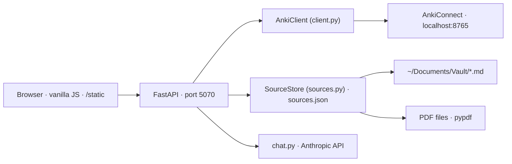

# Overview

> Map of the system for the maintainer. The README covers usage; each spec covers one concept end-to-end. **Specs are the source of truth: edit the spec first, then the code.**

## What the app does

A personal, local web app to **empty the queue of flagged Anki cards efficiently**, deck by deck. For each deck the user sees the flagged notes, the deck's sources (Obsidian notes, PDFs) side by side, and a Claude chat that knows the deck, the sources and the notes under review. Every decision is written straight into Anki through AnkiConnect.

Hugo flags a card during a review when something is wrong with it (too vague, wrong deck, should be split, needs a sibling card…). The reason is often typed into the note's `Back Extra` field. This app is where those flags get resolved.

## Vocabulary

- **Card** — what Anki schedules. A Cloze note with three clozes yields three cards.
- **Note** — the editable object (fields + tags). **The review unit is the note**: a note is *flagged* when any of its cards carries a flag; *resolving* a note clears the flag on all its cards. Flag colours carry no meaning here — any flag means "to review".
- **Reason** — the plain text of the `Back Extra` field of a flagged note (when the model has such a field). Displayed prominently as "why this was flagged"; Claude reads it; resolving a note offers to clear it.
- **Source** — a document a deck was made from: an Obsidian note in the vault, or a PDF on disk (optionally restricted to a page range). A deck has a **corpus**: an ordered list of sources. A deck with no corpus of its own inherits its nearest ancestor's corpus (`a::b::c` → `a::b` → `a`).
- **Decision** — what the user does with a flagged note: keep, edit, split, create a sibling, move, delete, skip. See [review.md](./review.md#decisions).
- **Proposal** — a structured change suggested by Claude in the chat (edit / split / create / move) that the user applies with one click. See [chat.md](./chat.md).

## Surfaces

One page, `/`, laid out as **three columns** (validated by prototype, variant A):

```
┌──────────────┬───────────────────────────────┬──────────────────────┐
│ Decks        │ Queue of the selected deck    │ [Source] [Chat] tabs │
│ (tree, flag  │ notes, flagged first;         │                      │
│  counts,     │ selected note expands with    │ source excerpts /    │
│  source dot) │ the decision buttons          │ chat + proposals     │
└──────────────┴───────────────────────────────┴──────────────────────┘
```

Detailed behaviour: [review.md](./review.md) (columns 1–2), [sources.md](./sources.md) (Source tab), [chat.md](./chat.md) (Chat tab).

There is also a CLI (`uv run anki …`) over the same client; it predates the web UI and stays as a debugging tool. Not specced beyond `README.md`.

## Architecture



- **No database.** Anki is the store for notes; `sources.json` is the store for the deck→corpus mapping; the chat conversation lives in browser memory and is dropped when the deck changes.
- **No undo, no journal.** Writes go straight to Anki (decision from 2026-09-05). Destructive actions (delete, split-with-delete) get a confirm step in the UI, nothing more.
- **Single user, local only.** No auth. Bind to `127.0.0.1`.

## Module map

| Path | Role | Spec |
|---|---|---|
| `src/anki_assistant/client.py` | Thin typed client over AnkiConnect | — |
| `src/anki_assistant/models.py` | `Card`, `Note` dataclasses, HTML → plain text | — |
| `src/anki_assistant/sources.py` | `SourceStore`, `Source`, corpus inheritance, excerpt extraction | [sources.md](./sources.md) |
| `src/anki_assistant/review.py` | Note-level view of a deck + the decisions (keep/edit/split/create/move/delete) | [review.md](./review.md) |
| `src/anki_assistant/chat.py` | Prompt assembly, Anthropic call, proposal tools, SSE events | [chat.md](./chat.md) |
| `src/anki_assistant/web/main.py` | FastAPI app factory, static mount, router includes, `run()` | — |
| `src/anki_assistant/web/routes_review.py` | `/api/decks`, `/api/notes…` | [review.md](./review.md#api) |
| `src/anki_assistant/web/routes_sources.py` | `/api/sources…`, `/api/vault/notes` | [sources.md](./sources.md#api) |
| `src/anki_assistant/web/routes_chat.py` | `/api/chat` (SSE) | [chat.md](./chat.md#api) |
| `src/anki_assistant/web/render.py` | Anki field HTML → display HTML (cloze spans, `<br>`, LaTeX alt text) | [review.md](./review.md#rendering) |
| `src/anki_assistant/web/templates/index.html` | The single page | — |
| `src/anki_assistant/web/static/app.js`, `app.css` | Frontend, no framework, no bundler | [review.md](./review.md#frontend) |
| `prototype/` | Throwaway UI prototype that settled the layout. Not maintained. | — |
| `tests/` | pytest, AnkiConnect mocked (`respx`/monkeypatch on `AnkiClient.invoke`) | — |

## Running

```bash
uv sync
uv run anki-web            # http://localhost:5070
```

Anki Desktop must be open with the AnkiConnect add-on. `ANTHROPIC_API_KEY` is read from the environment or `.env` (see `.env.example`); without it the app runs and the Chat tab explains what is missing.

Port 5070, not 506x: Firefox refuses ports 5060/5061 (reserved for SIP).

## Conventions

- Python ≥ 3.11, `ruff check`, `ruff format`, `ty check` must pass. Line length 100.
- Field values travel as **raw Anki HTML** through the API; the frontend renders through `render.py` output (`fields_html`) and edits the raw value (`fields`).
- IDs: Anki note and card ids are integers (epoch ms). Shown to the user as `#` + last 4 digits.
- French UI copy, English code and specs.
