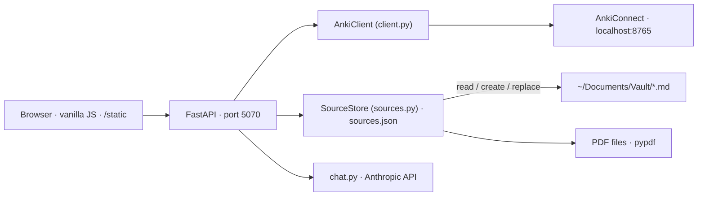

# Overview

> Map of the system for the maintainer. The README covers usage; each spec covers one concept end-to-end. **Specs are the source of truth: edit the spec first, then the code.**

## What the app does

A personal, local web app to **empty the queue of flagged Anki cards efficiently**, deck by deck. For each deck the user sees the flagged notes, the deck's sources (Obsidian notes, PDFs) side by side, and, once a note is opened in its workspace, a Claude chat that knows the deck, the sources and the cards being worked on. Everything is written into Anki through AnkiConnect, in one validation per workspace.

Hugo flags a card during a review when something is wrong with it (too vague, wrong deck, should be split, needs a sibling card…). The reason is often typed into the note's `Back Extra` field. This app is where those flags get resolved.

## Vocabulary

Note, card, note type, field, and reason are defined in [notes.md](./notes.md). The short versions:

- **Note** — the editable object (fields + tags + note type). The app's review unit. See [notes.md](./notes.md#note-card-note-type).
- **Card** — what Anki schedules; generated from a note by its note type's templates. See [notes.md](./notes.md#note-card-note-type).
- **Reason** — the plain text of the `Back Extra` field of a flagged note. "Why this was flagged." See [notes.md](./notes.md#reason-back-extra).
- **Source** — a document a deck was made from: an Obsidian note in the vault, or a PDF on disk (optionally restricted to a page range). A deck has a **corpus**: an ordered list of sources. A deck with no corpus of its own inherits its nearest ancestor's corpus (`a::b::c` → `a::b` → `a`). Every source has a stable **id**.
- **Anchor** — a source of its deck's corpus a note was made from; a note can have several. Stored in `sources.json` (note id → list of source ids), never in Anki. Opens the Source tab on the right documents and lets the chat load those alone. See [sources.md](./sources.md#anchors).
- **Decision** — what the user does with a flagged note from the queue: keep (clear the flag), skip, or open it in the workspace. See [review.md](./review.md#decisions).
- **Workspace** — the overlay opened on a note: the note and the changes being prepared for it as **cards** on the left, a conversation with Claude on the right. A card holds **versions** (v0 = Anki, then Claude's proposals and the user's edits); a split adds **fragment** cards; cards can be **active** (the next message is about them), deleted, kept or moved. One « Valider » writes everything, all or nothing; the × discards everything. See [workspace.md](./workspace.md).
- **Proposal** — a structured change suggested by Claude in the conversation (edit / split / create / move) that lands on the workspace as a version, a fragment, a new card or a badge — never written before validation. Claude can also **read** the collection (deck tree, note search, notes, note types) and the sources through read tools, and bring notes into the workspace; **no source text is in its context unless the user attaches it or Claude reads it**, both visibly. Two proposals write into the vault (create a note, replace a passage), on click. See [chat.md](./chat.md).

## Surfaces

One page, `/`, laid out as **three columns** (validated by prototype, variant A), plus the **workspace** overlay:

```
┌──────────────┬───────────────────────────────┬──────────────────────┐
│ Decks        │ Queue of the selected deck    │ [Source] tab         │
│ (tree, flag  │ notes, flagged first;         │                      │
│  counts,     │ click → workspace,            │ source excerpts      │
│  source dot) │ « garder » on each note       │                      │
└──────────────┴───────────────────────────────┴──────────────────────┘
        ┌──────────────────────────────────┬────────────────────────┐
        │ Workspace · cards                │ conversation           │
        │ root note (v0 ← → v1…), fragments│ chips · log · input    │
        │ notes pulled in by Claude        │                        │
        │                    [Valider] [×] │                        │
        └──────────────────────────────────┴────────────────────────┘
```

Detailed behaviour: [review.md](./review.md) (columns 1–2), [sources.md](./sources.md) (Source tab), [workspace.md](./workspace.md) (the overlay), [chat.md](./chat.md) (the conversation). Conventions of the notes themselves (raw field syntax, context header): [notes.md](./notes.md).

There is also a CLI (`uv run anki …`) over the same client; it predates the web UI and stays as a debugging tool. Not specced beyond `README.md`.

## Architecture



- **No database.** Anki is the store for notes; `sources.json` is the store for the deck→corpus mapping and the note→source anchors; the workspace and its conversation live in browser memory and are dropped when the workspace closes.
- **The vault is written in two bounded ways only.** Create a new note (refused if the file exists) and replace a passage that occurs exactly once. Always behind a user click. See [sources.md](./sources.md#writing-to-the-vault).
- **One write, one undo.** Anki is written only by « Garder » in the queue and by the workspace's validation, which writes all its changes or none (emulated: safe order, snapshot, rollback — decision from 2026-09-09, replacing « no undo, no journal » of 2026-09-05). The server keeps the snapshot of the last validation for a single « Annuler la dernière validation »; nothing is journaled beyond that. Deleting notes asks for a confirmation at validation, nothing else does.
- **Single user, local only.** No auth. Bind to `127.0.0.1`.

## Module map

| Path | Role | Spec |
|---|---|---|
| `src/anki_assistant/client.py` | Thin typed client over AnkiConnect | — |
| `src/anki_assistant/models.py` | `Card`, `Note` dataclasses, HTML → plain text | — |
| `src/anki_assistant/sources.py` | `SourceStore`, `Source`, corpus inheritance, anchors, excerpt extraction, vault writes | [sources.md](./sources.md) |
| `src/anki_assistant/review.py` | Note-level view of a deck + the primitive writes (keep/edit/split/create/move/delete) | [review.md](./review.md) |
| `src/anki_assistant/workspace.py` | Validation of a workspace: plan, snapshot, ordered writes, rollback, undo | [workspace.md](./workspace.md#module-workspacepy) |
| `src/anki_assistant/chat.py` | Prompt assembly, Anthropic call, proposal and read tools, SSE events | [chat.md](./chat.md) |
| `src/anki_assistant/web/main.py` | FastAPI app factory, static mount, router includes, `run()` | — |
| `src/anki_assistant/web/routes_review.py` | `/api/decks`, `/api/notes…` | [review.md](./review.md#api) |
| `src/anki_assistant/web/routes_workspace.py` | `/api/workspace/apply`, `/api/workspace/undo` | [workspace.md](./workspace.md#api) |
| `src/anki_assistant/web/routes_sources.py` | `/api/sources…`, `/api/vault/notes` | [sources.md](./sources.md#api) |
| `src/anki_assistant/web/routes_chat.py` | `/api/chat` (SSE) | [chat.md](./chat.md#api) |
| `src/anki_assistant/web/render.py` | Anki field HTML → display HTML (cloze spans, `<br>`, LaTeX alt text) | [review.md](./review.md#rendering) |
| `src/anki_assistant/web/templates/index.html` | The single page | — |
| `src/anki_assistant/web/static/*.js`, `app.css` | Frontend, no framework, no bundler (`workspace.js` = the overlay) | [review.md](./review.md#frontend), [workspace.md](./workspace.md#frontend) |
| `prototype/` | Throwaway UI prototype that settled the layout. Not maintained. | — |
| `tests/` | pytest, AnkiConnect mocked (`respx`/monkeypatch on `AnkiClient.invoke`) | — |

## Running

```bash
uv sync
uv run anki-web            # http://localhost:5070
```

Anki Desktop must be open with the AnkiConnect add-on. `ANTHROPIC_API_KEY` is read from the environment or `.env` (see `.env.example`); without it the app runs and the conversation pane of the workspace explains what is missing.

Port 5070, not 506x: Firefox refuses ports 5060/5061 (reserved for SIP).

## Conventions

- Python ≥ 3.11, `ruff check`, `ruff format`, `ty check` must pass. Line length 100.
- Field values travel as **raw Anki HTML** through the API; the frontend renders through `render.py` output (`fields_html`) and edits the raw value (`fields`).
- IDs: Anki note and card ids are integers (epoch ms). Shown to the user as `#` + last 4 digits.
- French UI copy, English code and specs.
