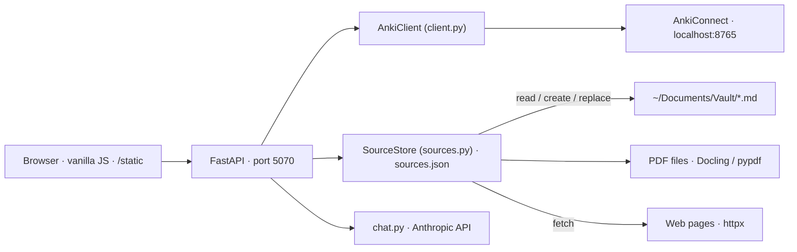

# Overview

> Map of the system for the maintainer. The README covers usage; each spec covers one concept end-to-end. **Specs are the source of truth: edit the spec first, then the code.**

## What the app does

A personal, local web app to **empty the queue of flagged Anki cards efficiently**, deck by deck. For each deck the user sees the flagged [notes](./notes.md), the deck's [sources](./sources.md) (Obsidian notes, PDFs, web pages) side by side, and, once a note is opened in the [workspace](./workspace.md), a [conversation with Claude](./chat.md) that reads the deck's notes and sources on demand and proposes edits, splits and creations that land on the workspace as versions and cards. Everything is written into Anki through AnkiConnect, in one validation per workspace.

The user flags a card during an Anki review when something is wrong with it (too vague, wrong deck, should be split, needs a sibling card…). The reason is often typed into the note's `Back Extra` field ([notes.md § Reason](./notes.md#reason-back-extra)). This app is where those flags get resolved.

## Specs

| File | Concept |
|---|---|
| [notes.md](./notes.md) | Note, card, note type, field, reason, field syntax |
| [review.md](./review.md) | The three-column page: deck tree, queue, decisions, rendering, keyboard |
| [sources.md](./sources.md) | Corpus, source, anchors, extracted text, vault writes, Source tab |
| [workspace.md](./workspace.md) | The overlay: cards, versions, split, flag toggle, validation, undo |
| [chat.md](./chat.md) | The conversation: system prompt, read tools, proposal tools, source proposals |
| [theme.md](./theme.md) | Visual identity: terminal look, Omarchy palettes, two-layer colour architecture, picker, logo |

## Architecture

**Where things are stored.** Anki is the store for notes; `sources.json` is the store for corpora and anchors; the workspace and its conversation live in browser memory and are dropped when the workspace closes. No database.

**Who writes to Anki.** Two paths only: « Garder » in the queue clears a flag ([review.md § Decisions](./review.md#decisions)); the workspace's « Valider » writes all its changes or none, with snapshot and rollback ([workspace.md § Validation](./workspace.md#validation)). The server keeps one snapshot for « Annuler la dernière validation ».

**Who writes to the vault.** Two operations only, both behind a user click: create a file, replace a passage ([sources.md § Writing to the vault](./sources.md#writing-to-the-vault)).

**Single user, local only.** No auth. Bound to `127.0.0.1`.

## Module map

| Path | Role | Spec |
|---|---|---|
| `src/anki_assistant/client.py` | Typed client over AnkiConnect | — |
| `src/anki_assistant/models.py` | `Card`, `Note` dataclasses | — |
| `src/anki_assistant/sources.py` | `SourceStore`: corpora, anchors, text extraction, vault writes | [sources.md](./sources.md) |
| `src/anki_assistant/pdf_cache.py` | Sidecar cache, structural index, Docling extraction | [sources.md](./sources.md) |
| `src/anki_assistant/review.py` | Note-level view of a deck, primitive writes | [review.md](./review.md) |
| `src/anki_assistant/workspace.py` | Validation: plan, snapshot, ordered writes, rollback, undo | [workspace.md](./workspace.md) |
| `src/anki_assistant/chat.py` | Prompt assembly, Anthropic call, tools, SSE streaming | [chat.md](./chat.md) |
| `src/anki_assistant/cli.py` | CLI over the same client (debugging tool, not specced) | — |
| `src/anki_assistant/web/main.py` | FastAPI app factory, static mount, router includes | — |
| `src/anki_assistant/web/routes_review.py` | `/api/decks`, `/api/notes…` | [review.md](./review.md#api) |
| `src/anki_assistant/web/routes_workspace.py` | `/api/workspace/apply`, `/api/workspace/undo` | [workspace.md](./workspace.md#api) |
| `src/anki_assistant/web/routes_sources.py` | `/api/sources…`, `/api/vault/notes` | [sources.md](./sources.md#api) |
| `src/anki_assistant/web/routes_chat.py` | `/api/chat` (SSE) | [chat.md](./chat.md#api) |
| `src/anki_assistant/web/render.py` | Field display transform | [review.md](./review.md#rendering) |
| `src/anki_assistant/web/errors.py` | Shared error handlers | — |
| `src/anki_assistant/web/templates/index.html` | The single page | — |
| `src/anki_assistant/web/static/` | Frontend: vanilla JS, no framework, no bundler | [review.md](./review.md#frontend), [theme.md](./theme.md) |
| `tests/` | pytest, AnkiConnect mocked | — |

## Conventions

French UI copy, English code and specs.
