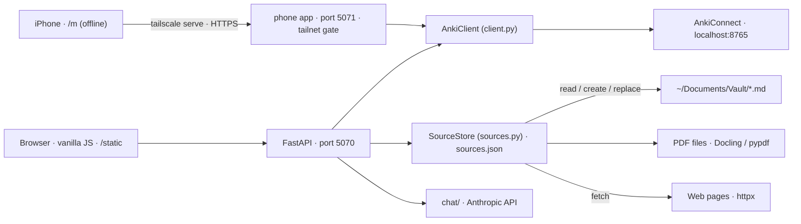

# Overview

> Map of the system for the maintainer. The README covers usage; each spec covers one concept end-to-end. **Specs are the source of truth: edit the spec first, then the code.**

## What the app does

A personal, local web app to **empty the queue of flagged Anki cards efficiently**, deck by deck. For each deck the user sees the flagged [notes](./notes.md), the deck's [sources](./sources.md) (Obsidian notes, PDFs, web pages) side by side, and, once a note is opened in the [workspace](./workspace.md), a [conversation with Claude](./chat.md) that reads the deck's notes and sources on demand and proposes edits, splits and creations that land on the workspace as versions and cards. Everything is written into Anki through AnkiConnect, in one validation per workspace.

The user flags a card during an Anki review when something is wrong with it (too vague, wrong deck, should be split, needs a sibling card…). The reason is often typed into the note's `Back Extra` field ([notes.md § Reason](./notes.md#reason-back-extra)). This app is where those flags get resolved.

## Specs

| File | Concept |
|---|---|
| [notes.md](./notes.md) | Note, card, note type, field, reason, field syntax |
| [review.md](./review.md) | The three-column page: deck tree, queue, decisions, rendering, keyboard |
| [priority.md](./priority.md) | Priority queue: urgency criteria, study-deck budget filtering, deck tree row |
| [sources.md](./sources.md) | Corpus, source, anchors, extracted text, vault writes, Source tab |
| [workspace.md](./workspace.md) | The overlay: cards, versions, split, flag toggle, validation, undo |
| [chat.md](./chat.md) | The conversation: system prompt, guidelines, read tools, proposal tools, source proposals |
| [theme.md](./theme.md) | Visual identity: terminal look, Omarchy palettes, two-layer colour architecture, picker, logo |
| [mobile.md](./mobile.md) | Phone app: batch, Anki day, precomputed outcomes, phone queue, pending actions, sync, review log, tailnet gate |

## Architecture

```mermaid
graph LR
    UI["Browser · vanilla JS · /static"] --> API["FastAPI · port 5070"]
    API --> Client["AnkiClient (client.py)"] --> AC["AnkiConnect · localhost:8765"]
    API --> Sources["SourceStore (sources.py) · sources.json"]
    Sources -- read / create / replace --> Vault["~/Documents/Vault/*.md"]
    Sources --> PDF["PDF files · Docling / pypdf"]
    Sources -- fetch --> Web["Web pages · httpx"]
    API --> Chat["chat/ · Anthropic API"]
    Phone["iPhone · /m (offline)"] -- tailscale serve · HTTPS --> Gate["phone app · port 5071 · tailnet gate"]
    Gate --> Client
```

**Where things are stored.** Anki is the store for notes; `sources.json` is the store for corpora and anchors; `guidelines.md` is the store for the chat's [guidelines](./chat.md#guidelines); `review_log.jsonl` and `mobile_actions.jsonl` hold the phone's [review log](./mobile.md#review-log) and the action ids already synced; the workspace and its conversation live in browser memory and are dropped when the workspace closes. No database.

**Who writes to Anki.** Three paths only: « Keep » in the queue clears a flag ([review.md § Decisions](./review.md#decisions)); the workspace's « Apply » writes all its changes or none, with snapshot and rollback ([workspace.md § Validation](./workspace.md#validation)); a phone [sync](./mobile.md#sync) replays answers, sets or clears the orange flag, suspends, and re-dates replayed cards. The server keeps one snapshot for « Undo last validation ».

**Who writes to the vault.** Two operations only, both behind a user click: create a file, replace a passage ([sources.md § Writing to the vault](./sources.md#writing-to-the-vault)).

**Single user, Mac plus phone.** No login. One process listens on two ports, both bound to `127.0.0.1`: the main app on `5070`, the phone app alone on the [phone port](./mobile.md#tailnet-gate) `5071`. Only the phone port is exposed on the tailnet, through `tailscale serve`, and its tailnet gate refuses every request that does not carry the owner's Tailscale login.

## Module map

| Path | Role | Spec |
|---|---|---|
| `src/anki_assistant/client.py` | Typed client over AnkiConnect | — |
| `src/anki_assistant/models.py` | `Card`, `Note` dataclasses | — |
| `src/anki_assistant/sources/` | `SourceStore`, corpora, anchors, text extraction, vault writes | [sources.md](./sources.md) |
| `src/anki_assistant/pdf_cache.py` | Sidecar cache, structural index, Docling extraction | [sources.md](./sources.md) |
| `src/anki_assistant/review.py` | Note-level view of a deck, primitive writes, priority queue | [review.md](./review.md), [priority.md](./priority.md) |
| `src/anki_assistant/workspace.py` | Validation: plan, snapshot, ordered writes, rollback, undo | [workspace.md](./workspace.md) |
| `src/anki_assistant/chat/` | Prompt assembly, Anthropic call, tools, SSE streaming | [chat.md](./chat.md) |
| `src/anki_assistant/mobile.py` | Anki day, batch building, outcome parsing, sync (replay, re-dating, dropped actions, review log) | [mobile.md](./mobile.md) |
| `src/anki_assistant/cli.py` | CLI over the same client (debugging tool, not specced) | — |
| `src/anki_assistant/web/main.py` | App factories (main app, phone app), static mount, router includes, entry point serving both ports | [mobile.md](./mobile.md#tailnet-gate) |
| `src/anki_assistant/web/routes_review.py` | `/api/decks`, `/api/notes…`, `/api/notes/priority` | [review.md](./review.md#api), [priority.md](./priority.md#api) |
| `src/anki_assistant/web/routes_workspace.py` | `/api/workspace/apply`, `/api/workspace/undo` | [workspace.md](./workspace.md#api) |
| `src/anki_assistant/web/routes_sources.py` | `/api/sources…`, `/api/vault/notes` | [sources.md](./sources.md#api) |
| `src/anki_assistant/web/routes_chat.py` | `/api/chat` (SSE) | [chat.md](./chat.md#api) |
| `src/anki_assistant/web/routes_mobile.py` | `/api/mobile/batch`, `/api/mobile/sync`, `/api/mobile/media/{filename}`, the page under `/m`, the phone port's shell files | [mobile.md](./mobile.md#api) |
| `src/anki_assistant/web/gate.py` | Tailnet gate middleware (phone app only) | [mobile.md](./mobile.md#tailnet-gate) |
| `src/anki_assistant/web/render.py` | Field display transform | [review.md](./review.md#rendering) |
| `src/anki_assistant/web/errors.py` | Shared error handlers | — |
| `src/anki_assistant/web/templates/index.html` | The single page | — |
| `src/anki_assistant/web/static/` | Frontend: vanilla JS, no framework, no bundler | [review.md](./review.md#frontend), [theme.md](./theme.md) |
| `tests/` | pytest, AnkiConnect mocked | — |

## Conventions

English UI copy, code and specs.
