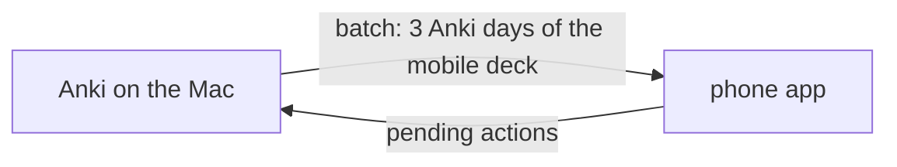

# Mobile reviewer

> Review one Anki deck on the iPhone, offline for days, with every answer replayed into Anki at the next sync.

General terms (*note*, *Anki card*, *note type*, *field*, *cloze*) are defined in [notes.md](./notes.md). Fields are shown through the [display transform](./review.md#rendering).

On the iPhone there is no Anki to review with, and the Mac is often off. The **phone app** is a page of this app, installed on the phone's home screen, that keeps working with no connection to the Mac. Whenever it can reach the Mac it runs a [sync](#sync): what was done on the phone goes to Anki, fresh cards come back.



Out of scope: editing cards from the phone, more than one deck, flag colours other than orange, a scheduler running on the phone.

## Phone app

The phone app is the page at `/m`, served by the same FastAPI app; its API is under `/api/mobile`. It reaches the Mac over the tailnet through `tailscale serve`, which provides the HTTPS that offline caching requires ([Tailnet gate](#tailnet-gate)).

It is installable on the home screen and works offline: the page, its scripts, MathJax and the batch's pictures are cached on the phone. Its data lives in the **phone store**: the browser storage on the phone (IndexedDB), which survives closing the page. The phone store holds the current [batch](#batch), the [pending actions](#pending-actions), the phone's copy of the [review log](#review-log), the cards buried today, and the outcome of each card answered since the batch was downloaded.

The page uses the main app's theme (`themes.css`, same picker and stored choice, [theme.md](./theme.md)).

The **mobile deck** is the one deck the phone app reviews: env `MOBILE_DECK`, default `courant`, sub-decks included.

## Anki day

An **Anki day** is a day as Anki counts it: it starts at Anki's **rollover hour** (env `ANKI_ROLLOVER_HOUR`, default `4`) in the Mac's local time, not at midnight. The Anki day of an instant is the calendar date of *(instant − rollover hour)*. At 02:00 on 7 October the Anki day is still 6 October.

**Today** is the Anki day of the current instant. Days are compared as dates; *N days later* is calendar arithmetic on the date.

## Batch

The **window** is the 3 Anki days starting today: day `0` (today), day `1`, day `2`.

The **daily quota** is how many review cards and new cards Anki would show in one Anki day for the mobile deck:

| Day | Reviews | New cards |
|---|---|---|
| 0 | `review_count` of `getDeckStats` (what is left today) | `new_count` of `getDeckStats` |
| 1, 2 | the deck options' `rev.perDay` (`getDeckConfig`) | the deck options' `new.perDay` |

Day 0 uses `getDeckStats` because a per-deck "This deck" limit override is invisible through AnkiConnect, while today's counts reflect it.

A **batch** is the cards the phone downloads at a sync: one daily quota per day of the window, plus the learning cards due that day, with everything needed to show and answer them offline. Suspended and buried cards (in Anki) are never in a batch. Within each day, cards come in this order — an approximation of Anki's own queue:

1. **learning cards** (queue 1 or 3) due by that day, by due ascending — not counted in the quota;
2. **review cards** (queue 2) due by that day, not taken by an earlier day, by due ascending (most overdue first), up to the day's review quota;
3. **new cards** not taken by an earlier day, by new position then card ordinal, up to the day's new quota.

"Due by day *k*" is Anki's `prop:due<=k`, so a backlog of overdue cards fills every day of the window.

A batch replaces the previous one at each sync; the phone keeps nothing of the old batch except pending actions and the review log.

### Batch card

Each card of a batch carries:

- its card id, note id, deck, note type and ordinal;
- its **day** (`0`, `1`, `2`) and its **kind** (`learn`, `review`, `new`);
- its **question** and **answer** content, as lists of `{ name, html }`, each field rendered by the display transform;
- its **cloze number** (`ord + 1`) for a cloze note type, `null` otherwise;
- its flag;
- the media file names its content references;
- its four [precomputed outcomes](#precomputed-outcomes).

**Question and answer fields** come from the card's template in its note type (for a cloze note type, the single template; otherwise the template at index `ord`):

- **question** = the fields referenced on the front template, in order of first reference;
- **answer** = the fields referenced on the back template, minus `{{FrontSide}}` and minus fields already in the question.

A reference is any `{{…}}` tag (`{{Field}}`, `{{cloze:Text}}`, `{{#Field}}` sections included); filters before the last `:` are ignored, and a name that is not one of the note's fields (`{{Tags}}`, `{{FrontSide}}`, add-on tags) is skipped. The answer side of the phone shows the question, then the answer: for a cloze card, `Text` is the question (cloze `c<cloze number>` hidden, as in [review.md § Question state](./review.md#question-state)) and the answer side reveals it, followed by `Back Extra`.

**Pictures.** The display transform points pasted pictures at `/api/media/<name>`; in a batch they point at `/api/mobile/media/<name>` instead, the route the [tailnet gate](#tailnet-gate) lets through. The batch lists each card's media names and their union, so the phone can download them all while online.

## Precomputed outcomes

A **precomputed outcome** is, for one card and one of the four answer buttons (again, hard, good, easy), the interval Anki would give the card, computed by Anki's own scheduler (FSRS) when the batch is made. AnkiConnect's `cardsInfo` returns them as `nextReviews`: four display strings in Anki's interface language, e.g. `<⁨10⁩m`, `⁨24⁩j`, `⁨3,9⁩mo`.

The batch carries them as seconds. Parsing a display string:

- Unicode isolation and direction marks (U+2066–U+2069, U+200E, U+200F) and spaces are removed, then a leading `<` or `>`;
- the number may use a decimal comma or point;
- units: `s` seconds; `m`, `min` minutes; `h` hours; `d`, `j` days; `mo` months; `y`, `a` years — a month is a year / 12, a year 365 days (Anki's own time-span constants);
- anything else gives `null`.

Months and years are displayed with one decimal, so an outcome above a month is accurate to about ±1.5 days.

The phone runs no scheduler. An outcome holds for the card's state at download: a card answered a second time on the phone (after « again ») has no outcome for that answer, and the phone treats it as leaving the window. A `null` outcome also leaves the window.

## Phone queue

The **phone queue** is what the phone app shows now. Rules the phone app implements:

1. **Today's share of the batch**, in batch order: the cards whose day's date (`days[day]`) is on or before the phone's today. The phone's today is computed with the batch's `rollover_hour` in the phone's local time. A card already answered on the phone leaves this share.
2. **Plus returning cards**: a card answered on the phone, once, comes back when its outcome says so:
   - outcome under one day → at *answered time + outcome*, in the same session, at the queue's head when that time has passed;
   - outcome of one day or more → on the Anki day *answer's Anki day + round(outcome / 1 day)*, if that day is in the window, at the end of that day's share;
   - otherwise (past the window, second answer, `null` outcome) → not until the next sync.
3. **Minus buried cards**: a card buried today is hidden until the next Anki day. Burying sends nothing to Anki.

The header shows the count left today. Answer buttons show the outcome as Anki displays it. **Undo** removes the last pending action (and, for an answer, its review-log entry and its outcome) and puts its card back at the head of the queue.

## Pending actions

A **pending action** is one thing done on the phone that Anki has not received yet:

| Kind | Sent to Anki at sync |
|---|---|
| `answer` (ease 1 again, 2 hard, 3 good, 4 easy) | [replayed](#sync) |
| `flag` | orange flag (`2`) set on the card |
| `unflag` | flag cleared (`0`) on the card |
| `suspend` | card suspended |

Each carries an **action id** generated on the phone (a UUID), the card id and the instant it was done (ms since epoch). An answer also carries its ease and the time spent on the card (ms). Pending actions stay in the phone store until a sync response lists them as applied or dropped.

## Review log

The **review log** is the permanent list of every answer given on the phone: card, button, time answered, time spent. It is kept on the phone and, at sync, appended to `review_log.jsonl` on the Mac (JSON lines, gitignored, next to `sources.json`). It is never sent to Anki: it is the history an own scheduler would start from, and survives leaving Anki.

One line per answer action, written when the sync first processes it, applied or dropped:

```json
{"action_id": "…", "card_id": 1692138612784, "ease": 3, "answered_at": 1759734120000,
 "time_ms": 8400, "synced_at": 1759900000000, "status": "applied", "reason": null}
```

## Sync

A **sync** starts when the page opens and the Mac answers, or with the ⟳ button. On the Mac, in order:

1. **Order.** The pending actions are applied oldest first (by instant; ties keep the order sent).
2. **Idempotency.** An action whose id was already processed by an earlier sync is not applied again; it is reported with the status it got then. Every processed action id is recorded in `mobile_actions.jsonl` (gitignored, next to `review_log.jsonl`) with its status, right after it is processed.
3. **Dropped actions.** Before applying an action, its card is checked. A **dropped action** is one whose card no longer exists (deleted, or split away), has left the mobile deck, or is suspended. The reasons are `card_missing`, `left_deck`, `suspended`. An edit to the card on the Mac does not drop it.
4. **Apply.** `answer` → **replay** with AnkiConnect `answerCards`, so Anki's scheduler updates the card as if answered now. `flag` → flag `2`. `unflag` → flag `0`. `suspend` → `suspend`.
5. **Re-dating.** After a replay, when the card is in review (queue 2) and the answer's Anki day is before today, the card's due date is moved to *answer's Anki day + the interval Anki just gave* (`setDueDate`, without `!`, so Anki keeps the interval), clamped to today: a sync two days late does not push the card two days back. Learning cards and same-day answers are left as Anki put them.
6. **Review log.** Each answer action processed for the first time is appended to the review log.
7. **New batch.** The Mac builds a new batch and returns it with the applied and dropped action ids; the phone clears those actions and replaces its batch.

If the Mac or Anki stops answering midway, the request fails and nothing is cleared on the phone; the actions already processed are skipped by the retry.

## Tailnet gate

The Mac sits on a tailnet shared with colleagues, and the app has no login. `tailscale serve --bg 5070` exposes the app over HTTPS at the Mac's `.ts.net` name while the server stays bound to `127.0.0.1`; Tailscale forwards each request with a `Tailscale-User-Login` header naming the sender, for user-owned devices only (not for tagged devices).

The **tailnet gate** is a check on every request. A request is **remote** when its `Host` header, port removed, is neither `localhost` nor `127.0.0.1`. A remote request is let through only when both hold:

- its path is `/m`, under `/m/`, under `/static/` (the stylesheets and scripts of the app; nothing secret), or under `/api/mobile/`, with no `..` segment;
- its `Tailscale-User-Login` header equals env `MOBILE_OWNER_LOGIN`.

Any other remote request gets `403`. When `MOBILE_OWNER_LOGIN` is unset or empty, every remote request gets `403`. Requests to `localhost` or `127.0.0.1` are unaffected.

## API

All routes are under `/api/mobile`. Errors follow [review.md § API](./review.md#api): Anki unreachable → `503`, other AnkiConnect failure → `502`, malformed body → `422`; bodies are `{ "detail": "<message>" }`.

| Method & path | Purpose |
|---|---|
| `GET /api/mobile/batch` | A fresh batch, nothing applied |
| `POST /api/mobile/sync` | Apply pending actions, then return a fresh batch |
| `GET /api/mobile/media/{filename}` | One media file, as `GET /api/media/{filename}` ([review.md § Rendering](./review.md#rendering)) |

**Batch** (`GET /api/mobile/batch`, and `batch` in the sync response):

```json
{
  "deck": "courant",
  "generated_at": 1759734120000,
  "rollover_hour": 4,
  "days": ["2026-10-06", "2026-10-07", "2026-10-08"],
  "quota": [{"review": 20, "new": 5}, {"review": 20, "new": 5}, {"review": 20, "new": 5}],
  "cards": [
    {
      "card_id": 1691390976232, "note_id": 1691390976230,
      "deck": "courant::04-maths", "model": "Cloze", "ord": 0,
      "day": 0, "kind": "review", "cloze": 1,
      "question": [{"name": "Text", "html": "… <span class=\"cloze\" data-n=\"1\">…</span>"}],
      "answer": [{"name": "Back Extra", "html": "…"}],
      "flag": 0,
      "media": ["paste-1a2b.jpg"],
      "outcomes": [600, 8935200, 15768000, 18658800],
      "outcome_labels": ["<10m", "3,4mo", "6mo", "7,1mo"]
    }
  ],
  "media": ["paste-1a2b.jpg"]
}
```

`days[k]` is the date of window day `k`. `cards` is in batch order (day 0 first). `outcomes` is `[again, hard, good, easy]` in seconds, each possibly `null`; `outcome_labels` are the same strings as Anki displays them, isolation marks removed. `html` values point pictures at `/api/mobile/media/`.

**Sync** (`POST /api/mobile/sync`), request:

```json
{
  "actions": [
    {"id": "6f1c…", "kind": "answer", "card_id": 1691390976232, "at": 1759734120000,
     "ease": 3, "time_ms": 8400},
    {"id": "9a0e…", "kind": "flag", "card_id": 1691390976232, "at": 1759734125000}
  ]
}
```

`kind` is `answer`, `flag`, `unflag` or `suspend`; `ease` (1–4) is required for an answer, `time_ms` defaults to `0`. Response:

```json
{
  "applied": ["6f1c…"],
  "dropped": [{"id": "9a0e…", "reason": "suspended"}],
  "batch": { "…": "as above" }
}
```

Every action id sent appears exactly once, in `applied` or `dropped`.
