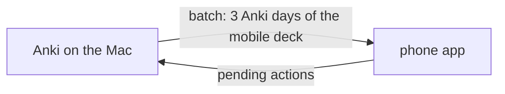

# Mobile reviewer

> Review one Anki deck on the iPhone, offline for days, with every answer replayed into Anki at the next sync.

General terms (*note*, *Anki card*, *note type*, *field*, *cloze*) are defined in [notes.md](./notes.md). Fields are shown through the [display transform](./review.md#rendering).

On the iPhone there is no Anki to review with, and the Mac is often off. The **phone app** is a page of this app, installed on the phone's home screen, that keeps working with no connection to the Mac. Whenever it can reach the Mac it runs a [sync](#sync): what was done on the phone goes to Anki, fresh cards come back.



Out of scope: editing cards from the phone, more than one deck, flag colours other than orange, a scheduler running on the phone.

## Phone app

The phone app is the page at `/m`, with its API under `/api/mobile`, served by the same process as the main app. The phone reaches it on a port of its own, the [phone port](#tailnet-gate), exposed on the tailnet through `tailscale serve`, which provides the HTTPS that offline caching requires.

It is installable on the home screen and works offline: the page, its scripts, MathJax and the batch's pictures are cached on the phone. Its data lives in the **phone store**: the browser storage on the phone (IndexedDB), which survives closing the page. The phone store holds the current [batch](#batch), the [pending actions](#pending-actions), the phone's copy of the [review log](#review-log), the cards buried today, and the outcome of each card answered since the batch was downloaded.

The page uses the main app's themes and stored theme choice ([theme.md](./theme.md)); its theme picker sits in the page's [menu](#phone-page).

The **mobile deck** is the one deck the phone app reviews: env `MOBILE_DECK`, default `courant`, sub-decks included.

## Anki day

An **Anki day** is a day as Anki counts it: it starts at Anki's **rollover hour** (env `ANKI_ROLLOVER_HOUR`, default `4`) in the Mac's local time, not at midnight. The Anki day of an instant is the calendar date of *(instant − rollover hour)*. At 02:00 on 7 October the Anki day is still 6 October.

**Today** is the Anki day of the current instant. Days are compared as dates; *N days later* is calendar arithmetic on the date.

## Batch

The **window** is the 3 Anki days starting today: day `0` (today), day `1`, day `2`.

The **daily quota** is how many review cards and new cards Anki would show in one Anki day for the mobile deck:

| Day | Reviews | New cards |
|---|---|---|
| 0 | `review_count` of `getDeckStats` (what is left today), plus the late replays of review cards | `new_count` of `getDeckStats`, plus the late replays of new cards |
| 1, 2 | the deck options' `rev.perDay` (`getDeckConfig`) | the deck options' `new.perDay` |

Day 0 uses `getDeckStats` because a per-deck "This deck" limit override is invisible through AnkiConnect, while today's counts reflect it.

A sync [replays](#sync) answers given on earlier Anki days, and Anki counts each replay as done today: after two offline days, today's `getDeckStats` counts are near `0` although nothing was reviewed today. A **late replay** is a card with an applied answer in the [review log](#review-log) synced today whose answer's Anki day is before today. Day 0 adds them back:

- each card counts once, however many of its answers were replayed;
- it counts as a new card when one of those entries has `was_new` true, as a review otherwise (an entry without `was_new` counts as a review);
- each sum is capped by the deck options' limit (`rev.perDay`, `new.perDay`), but never below the `getDeckStats` count.

Being read from the review log, the correction holds for every batch built the same Anki day, at a sync or at `GET /api/mobile/batch`.

A **batch** is the cards the phone downloads at a sync: one daily quota per day of the window, plus the learning cards due that day, with everything needed to show and answer them offline. Suspended and buried cards (in Anki) are never in a batch.

Each day's cards are gathered in order, then cut at the quota, so the order decides which cards are in the batch. The order follows the **order settings**: the display-order options of the mobile deck's options group (`getDeckConfig`). Only the mobile deck's options count; a sub-deck's options give limits, never order, as in Anki. The honoured values are below; any other value, or a missing option, keeps the default given for that option.

| Option | Honoured value | Default |
|---|---|---|
| `newGatherPriority` + `newSortOrder` | `0` (Deck) with `1` (Order gathered): new cards by deck order, then position | new cards by position, then ordinal, across sub-decks |
| `reviewOrder` | `2` (Deck, then due date): reviews and interday learning by deck order, then due | by due across sub-decks |
| `interdayLearningMix` | `0` (Mix with reviews) | interday learning before the reviews |
| `newMix` | `0` (Mix with reviews) | new cards after the reviews |

**Deck order** is Anki's deck-list order: a parent before its sub-decks, siblings by name with case ignored. **Review order** and **new order** are the orders the first two rows give.

Within each day:

1. **review cards** (queue 2) due by that day, not taken by an earlier day, in review order (ties by card id), the first up to the day's review quota;
2. **new cards** not taken by an earlier day, in new order (ties by card ordinal), the first up to the day's new quota;
3. **learning cards** due by that day, not counted in the quota: intraday learning (queue 1) by due, interday learning (queue 3) in review order.

The day's cards are then laid out: intraday learning first; then interday learning mixed into the reviews; then the new cards mixed into that. **Mixing** a shorter list into a longer one spreads it evenly, each list keeping its own order (Anki's intersperser). Where an option keeps its default, the lists follow each other instead of mixing.

"Due by day *k*" is Anki's `prop:due<=k`, so a backlog of overdue cards fills every day of the window.

A batch replaces the previous one at each sync; the phone keeps nothing of the old batch except pending actions and the review log.

### Batch card

Each card of a batch carries:

- its card id, note id, deck, note type and ordinal;
- its **day** (`0`, `1`, `2`) and its **kind** (`learn`, `review`, `new`);
- its **question** and **answer** content, as lists of `{ name, html }`, each field rendered by the display transform;
- its **cloze number** (`ord + 1`) for a cloze note type, `null` otherwise;
- its flag;
- the media file names its content references;
- its four [precomputed outcomes](#precomputed-outcomes).

**Question and answer fields** come from the card's template in its note type (for a cloze note type, the single template; otherwise the template at index `ord`):

- **question** = the fields referenced on the front template, in order of first reference;
- **answer** = the fields referenced on the back template, minus `{{FrontSide}}` and minus fields already in the question.

When the template is missing or its front references no field, the first field is the question and the other fields are the answer.

A reference is any `{{…}}` tag (`{{Field}}`, `{{cloze:Text}}`, `{{#Field}}` sections included); filters before the last `:` are ignored, and a name that is not one of the note's fields (`{{Tags}}`, `{{FrontSide}}`, add-on tags) is skipped. The answer side of the phone shows the question, then the answer: for a cloze card, `Text` is the question (cloze `c<cloze number>` hidden, as in [review.md § Question state](./review.md#question-state)) and the answer side reveals it, followed by `Back Extra`.

**Pictures.** The display transform points pasted pictures at `/api/media/<name>`; in a batch they point at `/api/mobile/media/<name>` instead, the route the [tailnet gate](#tailnet-gate) lets through. The batch lists each card's media names and their union, so the phone can download them all while online.

## Precomputed outcomes

A **precomputed outcome** is, for one card and one of the four answer buttons (again, hard, good, easy), the interval Anki would give the card, computed by Anki's own scheduler (FSRS) when the batch is made. AnkiConnect's `cardsInfo` returns them as `nextReviews`: four display strings in Anki's interface language, e.g. `<⁨10⁩m`, `⁨24⁩j`, `⁨3,9⁩mo`.

The batch carries them as seconds. Parsing a display string:

- Unicode isolation and direction marks (U+2066–U+2069, U+200E, U+200F) and spaces are removed, then a leading `<` or `>`;
- the number may use a decimal comma or point;
- units: `s` seconds; `m`, `min` minutes; `h` hours; `d`, `j` days; `mo` months; `y`, `a` years — a month is a year / 12, a year 365 days (Anki's own time-span constants);
- anything else gives `null`.

Months and years are displayed with one decimal, so an outcome above a month is accurate to about ±1.5 days.

The phone runs no scheduler. An outcome holds for the card's state at download: a card answered a second time on the phone (after « again ») has no outcome for that answer, and the phone treats it as leaving the window. A `null` outcome also leaves the window.

## Phone queue

The **phone queue** is what the phone app shows now. Rules the phone app implements:

1. **Today's share of the batch**, in batch order: the cards whose day's date (`days[day]`) is on or before the phone's today. The phone's today is computed with the batch's `rollover_hour` in the phone's local time. A card already answered on the phone leaves this share.
2. **Plus returning cards**: a card answered on the phone, once, comes back when its outcome says so:
   - outcome under one day → at *answered time + outcome*, in the same session, at the queue's head when that time has passed;
   - outcome of one day or more → on the Anki day *answer's Anki day + round(outcome / 1 day)*, if that day is in the window, at the end of that day's share;
   - otherwise (past the window, second answer, `null` outcome) → not until the next sync.
3. **Minus buried cards**: a card buried today is hidden until the next Anki day. Burying sends nothing to Anki.

**Left today** is the number of cards the phone app still shows today: the phone queue now, plus the same-day returns whose time falls before the next rollover. It splits like Anki's counts; each card of it is in exactly one part:

| Part | Cards |
|---|---|
| **new** | cards of today's share of kind `new` |
| **learning** | same-day returns (outcome under one day: due now or later today), plus cards of today's share of kind `learn` |
| **review** | cards of today's share of kind `review`, plus cards returning on a later Anki day (outcome of one day or more) whose day has come |

Today's share holds only cards not answered on the phone, and suspended and buried cards are in no part, so the three parts sum to left today.

Answer buttons show the outcome as Anki displays it. **Undo** takes back the last pending action (and, for an answer, its review-log entry and its outcome) or the last burial, whichever is more recent ([Phone page § Bury and undo](#phone-page)), and puts its card back at the head of the queue.

## Pending actions

A **pending action** is one thing done on the phone that Anki has not received yet:

| Kind | Sent to Anki at sync |
|---|---|
| `answer` (ease 1 again, 2 hard, 3 good, 4 easy) | [replayed](#sync) |
| `flag` | orange flag (`2`) set on the card |
| `unflag` | flag cleared (`0`) on the card |
| `suspend` | card suspended |

Each carries an **action id** generated on the phone (a UUID), the card id and the instant it was done (ms since epoch). An answer also carries its ease and the time spent on the card (ms). Pending actions stay in the phone store until a sync response lists them as applied or dropped.

## Review log

The **review log** is the permanent list of every answer given on the phone: card, button, time answered, time spent. It is kept on the phone and, at sync, appended to `review_log.jsonl` on the Mac (JSON lines, gitignored, at the repository root). It is never sent to Anki: it is the history an own scheduler would start from, and survives leaving Anki.

One line per answer action, written when the sync first processes it, applied or dropped:

```json
{"action_id": "…", "card_id": 1692138612784, "ease": 3, "answered_at": 1759734120000,
 "time_ms": 8400, "synced_at": 1759900000000, "status": "applied", "reason": null,
 "was_new": false}
```

`answered_at` and `synced_at` are ms since epoch. `was_new` is whether the card was new (`cardsInfo` `type` `0`) when the sync processed the answer, before the replay; `null` when the card no longer exists. Lines written before `was_new` existed lack it.

## Sync

A **sync** starts when the page opens and the Mac answers, or with the ⟳ button. On the Mac, in order:

1. **Order.** The pending actions are applied oldest first (by instant; ties keep the order sent).
2. **Idempotency.** An action whose id was already processed by an earlier sync is not applied again; it is reported with the status it got then. Every processed action id is recorded in `mobile_actions.jsonl` (gitignored, next to `review_log.jsonl`) with its status, right after it is processed.
3. **Dropped actions.** Before applying an action, its card is checked. A **dropped action** is one whose card no longer exists (deleted, or split away), has left the mobile deck, or is suspended. The reasons are `card_missing`, `left_deck`, `suspended`. An edit to the card on the Mac does not drop it.
4. **Apply.** `answer` → **replay** with AnkiConnect `answerCards`, so Anki's scheduler updates the card as if answered now. `flag` → flag `2`. `unflag` → flag `0`. `suspend` → `suspend`.
5. **Re-dating.** After a replay, when the card is in review (queue 2) and the answer's Anki day is before today, the card's due date is moved to *answer's Anki day + the interval Anki just gave* (`setDueDate`, without `!`, so Anki keeps the interval), clamped to today: a sync two days late does not push the card two days back. Learning cards and same-day answers are left as Anki put them.
6. **Review log.** Each answer action processed for the first time is appended to the review log.
7. **New batch.** The Mac builds a new batch and returns it with the applied and dropped action ids; the phone clears those actions and replaces its batch.

If the Mac or Anki stops answering midway, the request fails and nothing is cleared on the phone; the actions already processed are skipped by the retry.

## Tailnet gate

The Mac sits on a tailnet shared with colleagues, and the app has no login. `tailscale serve` exposes one local port over HTTPS at the Mac's `.ts.net` name; it forwards each request with a `Tailscale-User-Login` header naming the sender, for user-owned devices only (not for tagged devices), and replaces any such header the sender put.

The **phone port** is a second local port, env `MOBILE_PORT` (default `5071`), bound to `127.0.0.1` like the main port (`5070`). `uv run anki-web` listens on both in one process, and both ports share the AnkiConnect client, the mobile deck, the rollover hour and the review log. A request is routed by the local port of the socket it arrived on, never by anything the request carries; a request whose local port is unknown is treated as arriving on the phone port. The phone port serves only the phone app:

| Request | Served |
|---|---|
| `GET /m`, `GET /m/manifest.webmanifest`, `GET /m/sw.js` | the [page](#phone-page) |
| `GET /static/<name>` | only the page's shell files, the ones the service worker precaches |
| `/api/mobile/*` | the [API](#api) |

Any other request is `404`. `tailscale serve` points at the phone port, never at the main port, so nothing on the tailnet reaches the main app, whatever the request carries.

The **tailnet gate** is the check on every request to the phone port, before routing: its `Tailscale-User-Login` header must be present once and equal env `MOBILE_OWNER_LOGIN` (surrounding spaces ignored, case kept); else `403` with `{ "detail": "Forbidden" }`. When `MOBILE_OWNER_LOGIN` is unset or empty, every request to the phone port gets `403`. No other header, `Host` included, plays a part.

The main port has no gate. It also serves `/m` and `/api/mobile/*`, so the phone app can be tried on the Mac at `http://localhost:5070/m`.

## Phone page

The page the phone app is made of. Vanilla JS like the main app; the phone-queue rules and the phone actions live in `static/mobile-queue.js`, a module with no DOM, and the page (`static/mobile.js`) holds the display, the phone store and the sync.

**Layout.** One column filling the screen, within the safe-area insets:

```
☰  courant  5 2 11 · 2 pending                ⟳ 07:42
────────────────────────────────────────────────────
  question fields                     (scrolls)
  ── after « show answer »: answer fields, named ──
────────────────────────────────────────────────────
  [            show answer            ]
  again <10m │ hard 24j │ good 3mo │ easy 3,9mo
  ⚑ flag      ↶ undo      bury      suspend
  review log: 412 answers on this phone · last sync …
```

- **Header**: the menu button (☰), the mobile deck, [left today](#phone-queue) as its three parts in Anki's order and colours — new (blue), learning (red), review (green) —, the number of pending actions when there are any, the sync button with the time of the last successful sync, or « offline » when the last attempt failed.
- **Menu**: the menu button opens a panel under the header holding the theme picker; a second tap on the button, or a tap outside the panel, closes it. The theme picker appears nowhere else on the page. Besides the themes, grouped by mode, it offers « auto (follow the phone) », which clears the stored choice ([theme.md § Picker](./theme.md#picker)).
- **Notice**: a bar under the header, hidden when there is nothing to say, dismissed with « ok ». It shows the actions a sync dropped (count and reasons), an HTTP error from a sync, and, as a warning, that the phone store is unavailable or a write to it failed.
- **Card**: a line with the card's deck, its kind and « ⚑ flagged » when its current state is flagged; then the question fields, without names; on a cloze card, cloze `c<cloze number>` hidden as `[…]`/`[hint]`. Once revealed: the question again with every cloze shown, then the non-empty answer fields, each under its name. Math is typeset after each render. Pictures fit the width.
- **Action bar**, fixed at the bottom: « show answer » (a tap anywhere on the card does the same); once revealed, the four answer buttons, each labelled with its `outcome_labels` entry, or « — » on a card already answered on the phone (its answer has no outcome); below, flag, undo, bury, suspend. The flag button shows the card's current state — the batch's flag, overridden by the card's last pending flag/unflag — and toggles it: a flagged card (any colour) gets `unflag`, an unflagged one `flag`. Buttons are at least 44 px high. Under the buttons, the last line of the screen: the number of answers in the phone's review log (and whether it is kept on the phone or in memory only), and the date and time of the last successful sync.
- **Empty queue**: « done for today », with the time the next same-day return comes back when there is one; « sync to get more cards » when today is past the window's last day; « no cards yet: sync with the Mac » before the first batch.

Keys are a convenience for testing on the Mac: `Space` shows the answer, `1`–`4` answer, `u` undoes.

**Time spent** on an answer runs from the moment the card is displayed to the tap on an answer button, capped at 60 s (Anki's default maximum answer time), so a card left on screen does not log hours.

**Bury and undo.** Burying records `{card, Anki day, instant}` in the phone store and sends nothing. Undo takes back the most recent of the last pending action and the last burial; after a sync has cleared the pending actions, undo reaches only burials. The card concerned goes to the head of the queue.

**Phone store.** An IndexedDB database `anki-mobile`: the batch, the pending actions, the answers since the batch (action id, card, instant, ease, outcome), the burials and the last sync instant in one store; the review log in another, one entry per answer action, never cleared. Every phone action writes in one transaction before the screen changes. When IndexedDB is unavailable, the page keeps the store in memory and says that actions will be lost when it closes.

**Sync on the phone.** Runs on page load, when the page becomes visible again, when the phone comes back online, and with the ⟳ button; one at a time. It sends the pending actions as they are when it starts. On success, it removes the ids listed in `applied` and `dropped` from the pending actions, replaces the batch, keeps only the answers whose action is still pending, drops burials of past days, and shows a notice when actions were dropped (count and reasons). On any failure (no network, HTTP error, timeout of 20 s), nothing changes and the header says « offline »; an HTTP error also shows its detail as a notice.

**Offline.** A service worker at `/m/sw.js`, scope `/m` (`Service-Worker-Allowed: /m`), serves:

| Request | Strategy |
|---|---|
| the page `/m` | network first (4 s timeout), cache fallback |
| the page's static files and the manifest | precached at install, cache first; their URLs carry a version (a hash of the shell files), so a new version is new URLs and a new service worker |
| MathJax on `cdn.jsdelivr.net` | cache first, cached on first fetch; the script and its common fonts are precached at install |
| `/api/mobile/media/<name>` | cache first, cached on fetch |
| other `/api/mobile/*` | network only |

After each sync the page downloads every media file of the batch not yet cached, and removes cached media the batch no longer lists.

The web app manifest is at `/m/manifest.webmanifest` (standalone display, start URL `/m`, theme colour of the default dark theme, the star as icon); the page carries the iOS home-screen tags and a 180 px PNG of the star as `apple-touch-icon`.

## API

All routes are under `/api/mobile`, on the phone port and on the main port ([Tailnet gate](#tailnet-gate)). Errors follow [review.md § API](./review.md#api): Anki unreachable → `503`, other AnkiConnect failure → `502`, malformed body → `422`; bodies are `{ "detail": "<message>" }`.

| Method & path | Purpose |
|---|---|
| `GET /api/mobile/batch` | A fresh batch, nothing applied |
| `POST /api/mobile/sync` | Apply pending actions, then return a fresh batch |
| `GET /api/mobile/media/{filename}` | One media file, as `GET /api/media/{filename}` ([review.md § Rendering](./review.md#rendering)) |

The page itself is served outside `/api`: `GET /m` (the page), `GET /m/manifest.webmanifest`, `GET /m/sw.js` ([Phone page](#phone-page)).

**Batch** (`GET /api/mobile/batch`, and `batch` in the sync response):

```json
{
  "deck": "courant",
  "generated_at": 1759734120000,
  "rollover_hour": 4,
  "days": ["2026-10-06", "2026-10-07", "2026-10-08"],
  "quota": [{"review": 20, "new": 5}, {"review": 20, "new": 5}, {"review": 20, "new": 5}],
  "cards": [
    {
      "card_id": 1691390976232, "note_id": 1691390976230,
      "deck": "courant::04-maths", "model": "Cloze", "ord": 0,
      "day": 0, "kind": "review", "cloze": 1,
      "question": [{"name": "Text", "html": "… <span class=\"cloze\" data-n=\"1\">…</span>"}],
      "answer": [{"name": "Back Extra", "html": "…"}],
      "flag": 0,
      "media": ["paste-1a2b.jpg"],
      "outcomes": [600, 8935200, 15768000, 18658800],
      "outcome_labels": ["<10m", "3,4mo", "6mo", "7,1mo"]
    }
  ],
  "media": ["paste-1a2b.jpg"]
}
```

`days[k]` is the date of window day `k`. `cards` is in batch order (day 0 first). `outcomes` is `[again, hard, good, easy]` in seconds, each possibly `null`; `outcome_labels` are the same strings as Anki displays them, isolation marks removed. `html` values point pictures at `/api/mobile/media/`.

**Sync** (`POST /api/mobile/sync`), request:

```json
{
  "actions": [
    {"id": "6f1c…", "kind": "answer", "card_id": 1691390976232, "at": 1759734120000,
     "ease": 3, "time_ms": 8400},
    {"id": "9a0e…", "kind": "flag", "card_id": 1691390976232, "at": 1759734125000}
  ]
}
```

`kind` is `answer`, `flag`, `unflag` or `suspend`; `ease` (1–4) is required for an answer, `time_ms` defaults to `0`. Response:

```json
{
  "applied": ["6f1c…"],
  "dropped": [{"id": "9a0e…", "reason": "suspended"}],
  "batch": { "…": "as above" }
}
```

Every action id sent appears exactly once, in `applied` or `dropped`.
